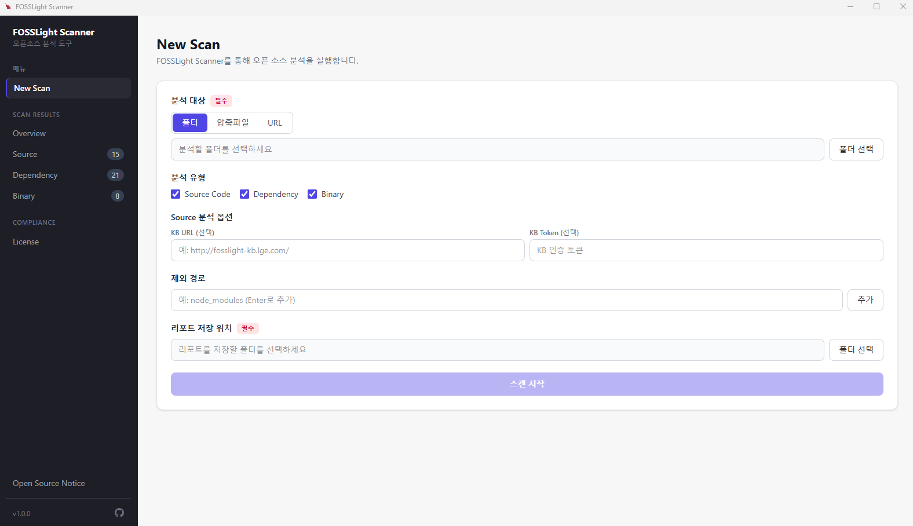
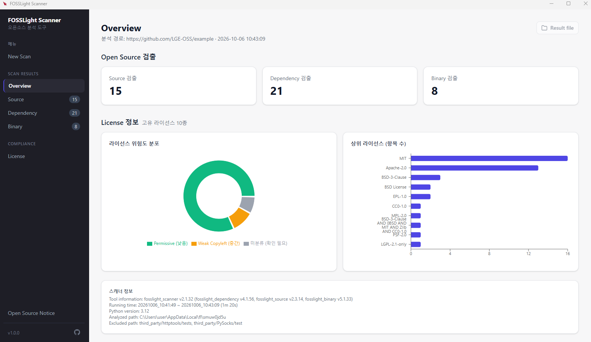
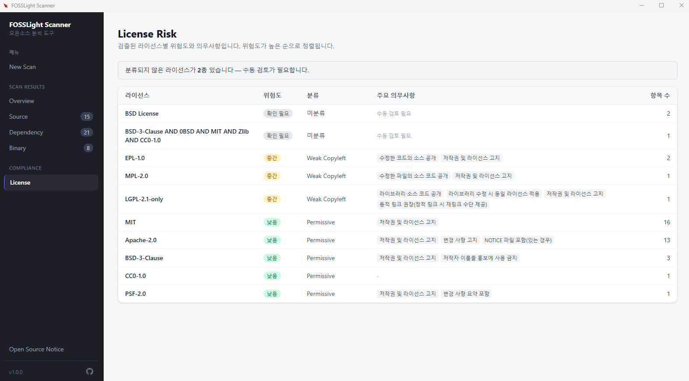

# FOSSLight Scanner GUI

Windows에서 프로젝트의 오픈소스와 라이선스를 찾아 주는 데스크톱 앱입니다. 분석할 폴더나 파일을 고르고 **스캔 시작**을 누르면, 화면에서 결과를 보고 엑셀 리포트로 저장할 수 있습니다.

Python이나 스캐너를 따로 설치하지 않아도 됩니다. 설치 파일 안에 분석 엔진이 들어 있습니다.

- 설치 파일: [Releases](https://github.com/fosslight/fosslight_scanner_gui/releases)의 `fosslight-scanner-gui-<버전>-setup.exe`
- 지원 환경: Windows 10 / 11 (64비트)

## 분석대상

한 번의 스캔에서 아래 세 가지를 함께 볼 수 있습니다. 필요한 항목만 골라서 실행할 수도 있습니다.

| 분석 | 보는 대상 | 이런 경우에 켭니다 |
|:-----|:----------|:-------------------|
| **Source Code** | 소스 코드 안의 라이선스 문구, 저작권, 코드 조각 | 소스 폴더를 그대로 분석할 때 |
| **Dependency** | `package.json`, `pom.xml` 같은 파일에 적힌 라이브러리와 그 하위 라이브러리 | 패키지로 받아 쓰는 오픈소스를 확인할 때 |
| **Binary** | 바이너리 파일 목록과, 알고 있는 오픈소스 정보 | 빌드 결과물이나 라이브러리 파일이 있을 때 |

분석할 수 있는 대상은 세 가지입니다.

- 내 PC의 폴더
- 압축 파일 (zip, tar, tar.gz, tgz, tar.bz2, tar.xz, bz2, jar, whl, rpm, src.rpm)
- 주소 (`https://` 또는 `git@`로 시작). Git 저장소는 받아서 분석하고, 주소가 압축 파일로 끝나면 그 파일을 내려받아 분석합니다.

## 설치

1. [Releases](https://github.com/fosslight/fosslight_scanner_gui/releases)에서 `fosslight-scanner-gui-<버전>-setup.exe`를 받습니다. 파일 크기는 약 259MB입니다.
2. 설치 파일을 실행합니다. **Windows의 PC 보호** 창이 나오면 **추가 정보**를 누른 뒤 **실행**을 누릅니다. 코드 서명이 없는 설치 파일에서 나오는 안내입니다.
3. 설치 위치를 확인하고 **설치**를 누릅니다. 기본 위치는 사용자 폴더 안의 `AppData\Local\Programs\fosslight-scanner-gui`이며, 설치 화면에서 바꿀 수 있습니다. 관리자 권한은 필요하지 않습니다.
4. 설치가 끝나면 바탕화면 또는 시작 메뉴의 **FOSSLight Scanner**로 실행합니다.

설치만 할 때는 인터넷이 없어도 됩니다. 설치 후 용량은 약 1GB이며, 대부분은 Source 분석에 쓰는 라이선스 데이터입니다.

주소로 프로젝트를 받거나, 없는 개발 도구를 설치할 때는 인터넷이 필요합니다. Git 저장소 주소를 분석하려면 PC에 [Git](https://git-scm.com/download/win)이 설치되어 있어야 합니다. 압축 파일 주소는 Git 없이 동작합니다.

## 실행하기

왼쪽 메뉴에서 **New Scan**을 엽니다.

1. **분석 대상**에서 **폴더**, **압축파일**, **URL** 중 하나를 고릅니다.
   - **폴더**: **폴더 선택**으로 프로젝트 폴더를 지정합니다. 리포트 저장 위치는 그 폴더로 채워집니다.
   - **압축파일**: **파일 선택**으로 zip, tar.gz, jar 같은 파일을 지정합니다. 앱이 압축을 푼 뒤 분석합니다. 리포트는 그 파일이 있는 폴더에 저장됩니다.
   - **URL**: 주소를 입력합니다. Git 저장소라면 **Branch 또는 Tag**를 적을 수 있고, 비워 두면 기본 브랜치를 사용합니다. 입력칸에서 포커스가 빠지면 그 브랜치나 태그가 있는지 확인합니다. 없으면 비슷한 이름을 보여 주고, 스캔은 시작되지 않습니다.
2. **분석 유형**에서 실행할 항목을 고릅니다. 처음에는 세 가지가 모두 선택되어 있습니다. 하나 이상은 켜 두어야 합니다.
3. Source Code를 켠 경우 **KB URL**과 **KB Token**이 보입니다. 조직에서 받은 주소와 토큰이 있을 때만 입력합니다. 비워 두면 그 서버 없이 Source 분석을 진행합니다.
4. 분석에서 빼려는 폴더가 있으면 **제외 경로**에 적고 **추가**를 누릅니다. Enter 키로도 추가됩니다. 예: `node_modules`
5. **리포트 저장 위치**를 확인합니다. 폴더와 압축파일은 자동으로 채워지고, URL은 **폴더 선택**으로 직접 지정합니다.
6. **스캔 시작**을 누릅니다.

주소 예시는 아래와 같습니다.

- Git 저장소: `https://github.com/fosslight/fosslight_scanner`
- 특정 태그: 위 주소를 넣고 Branch 또는 Tag에 `v2.1.25`
- 압축 파일 주소: `https://github.com/fosslight/fosslight_scanner/archive/refs/tags/v2.1.25.zip`

**스캔 시작**이 비활성화되어 있으면 분석 대상이나 저장 위치가 비어 있거나, 입력한 Branch 또는 Tag 확인이 끝나지 않은 상태입니다.

## 분석 진행 과정

스캔이 시작되면 단계가 **다운로드 → 도구 설치 → 준비 → 분석 → 결과 정리** 순서로 표시됩니다. 다운로드와 도구 설치는 필요할 때만 진행됩니다. 왼쪽 메뉴 아래에는 **스캔 진행 중...**이 보입니다.

프로젝트 크기에 따라 몇 분에서 몇십 분이 걸릴 수 있습니다. 화면의 로그는 저장 위치의 `fosslight_gui_<timestamp>.log`에도 같은 내용으로 남습니다.

**취소**를 누르면 확인 후 작업이 멈추고, **스캔이 취소되었습니다.**가 표시됩니다.

끝난 뒤 화면은 이렇게 구분합니다.

- **빨간색 배너**: 스캔이 완료되지 않았습니다. 메시지를 확인한 뒤 다시 실행합니다.
- **노란색 경고**: 분석은 끝났고 리포트도 만들어졌습니다. 일부 도구가 없거나 설치에 실패한 경우입니다. 해당 패키지의 의존성만 빠졌을 수 있으니 경고 내용을 확인합니다.
- 완료 후 왼쪽 **Overview**에 **New**가 붙습니다. 그 화면으로 결과를 확인합니다.

앱을 다시 실행하면 마지막으로 성공한 스캔 결과가 열립니다.

## 결과 확인

### Overview에서 먼저 확인하기

**Overview**는 이번 스캔의 요약입니다.

- **Open Source 검출**: Source, Dependency, Binary에서 찾은 건수입니다. 카드를 누르면 그 목록으로 이동합니다.
- **License 정보**: 서로 다른 라이선스가 몇 종인지, 위험도가 어떻게 나뉘는지, 항목이 많은 라이선스가 무엇인지 보여 줍니다. Strong Copyleft 또는 Restricted가 있으면 빨간 경고가 나오고, 누르면 License 화면으로 이동합니다.
- **Result file**: 리포트가 저장된 폴더를 탐색기에서 엽니다.
- **스캐너 정보**: 어떤 스캐너가 실행되었는지, 분석 경로와 제외 경로가 무엇인지 적혀 있습니다.

제외 경로로 빠진 항목과 Exclude로 표시된 항목은 이 통계에 포함되지 않습니다.

위험도가 높은 라이선스가 있으면 License 화면을 먼저 보고, 이어서 건수가 있는 Source, Dependency, Binary 목록을 확인하면 됩니다.

### 검출 목록 보기

왼쪽의 **Source**, **Dependency**, **Binary** 옆 숫자는 검출 건수입니다. 목록은 한 페이지에 50건씩 나옵니다.

- 위 검색칸에서 경로, OSS 이름, 라이선스를 찾을 수 있습니다.
- 열 제목을 누르면 정렬됩니다.
- 행을 누르면 Download Location, Homepage, Copyright, Comment가 펼쳐집니다.
- Exclude인 행은 흐리게 표시됩니다.

경로 열 이름은 화면마다 다릅니다. Source는 **Source Path**, Dependency는 **Package URL**, Binary는 **Binary Path**입니다.

### 라이선스 의무 확인하기

**License** 화면은 검출된 라이선스를 위험도가 높은 순으로 모읍니다. 각 라이선스 옆에는 주요 의무사항이 함께 나옵니다. 행을 누르면 그 라이선스가 어떤 항목에서 나왔는지 펼쳐집니다.

| 분류 | 화면에 표시되는 위험도 | 이렇게 보면 됩니다 |
|:-----|:-----------------------|:-------------------|
| Restricted | 높음 | 사용 조건이 엄격합니다. 배포 전에 의무사항을 확인합니다. |
| Strong Copyleft | 높음 | 수정하거나 함께 배포할 때 소스 공개 의무가 있을 수 있습니다. |
| Weak Copyleft | 중간 | 라이브러리 자체에는 의무가 있고, 이를 쓰는 코드 전체에 퍼지는 범위는 라이선스마다 다릅니다. |
| Permissive | 낮음 | 저작권과 라이선스 고지가 중심인 경우가 많습니다. |
| 미분류 | 확인 필요 | 앱이 분류하지 못한 이름입니다. 화면 위 안내대로 직접 확인합니다. |

미분류 라이선스는 숨기지 않습니다. 표 위에 **분류되지 않은 라이선스가 있습니다**라고 표시됩니다.

## 저장되는 파일

**리포트 저장 위치**에 아래 파일이 생깁니다. Overview의 **Result file**로 그 폴더를 열 수 있습니다.

| 파일 | 용도 |
|:-----|:-----|
| `fosslight_report_*.xlsx` | 이번 분석의 엑셀 리포트입니다. [FOSSLight Hub](https://fosslight.org/hub-guide/learn/2_fosslight_report.html)에 올릴 수 있습니다. |
| `fosslight_report_*.yaml` | 같은 결과의 YAML 파일입니다. |
| `fosslight_gui_<timestamp>.log` | 스캔 화면에 보였던 로그입니다. 경고나 실패 원인을 다시 볼 때 엽니다. |
| `gui_result.json` | 앱이 결과를 다시 열 때 읽는 파일입니다. |

화면에서 본 표와 엑셀은 같은 분석 결과입니다. Hub에 올리거나 다른 사람에게 전달할 때는 엑셀 파일을 사용합니다.

## 의존성 분석에 필요한 프로그램

**Dependency**를 켜면, 프로젝트 안의 파일에 맞춰 필요한 프로그램을 확인합니다. 없으면 분석을 시작하기 전에 준비합니다. 압축 파일과 URL은 받은 뒤에 같은 방식으로 확인합니다. 준비에 실패해도 스캔 전체가 멈추지는 않고, 그 패키지 종류만 실패할 수 있습니다. 이 경우는 노란색 경고로 알려 줍니다.

Windows 권한 창이 나오면 허용해야 설치가 계속됩니다.

| 프로젝트에 있는 파일 | 필요한 프로그램 | 없을 때 |
|:---------------------|:----------------|:--------|
| package.json | Node.js (npm) | 앱이 설치합니다. 설치 도구를 쓸 수 없으면 이번 분석에만 쓸 파일을 받아 사용합니다. |
| pom.xml | Apache Maven, Java | Maven Wrapper(`mvnw`)나 이미 설치된 Maven이 없으면 Maven을 준비합니다. Java도 없으면 준비합니다. |
| build.gradle, build.gradle.kts | Java | Gradle은 설치하지 않고 프로젝트 안의 Gradle Wrapper를 사용합니다. Java가 없으면 준비합니다. |
| requirements.txt, setup.py, setup.cfg, pyproject.toml, Pipfile | Python | 앱에 포함된 Python으로 분석합니다. 따로 설치하지 않아도 됩니다. |
| go.mod | Go | 앱이 설치합니다. |
| Chart.yaml | Helm | 앱이 설치합니다. |
| Cargo.toml | Rust (cargo) | 앱이 설치합니다. |
| Gemfile | Ruby | 앱이 설치합니다. |
| pubspec.yaml | Flutter | 자동으로 설치하지 않습니다. [Flutter Windows 설치 안내](https://docs.flutter.dev/get-started/install/windows)대로 설치한 뒤 다시 스캔합니다. |
| Podfile, Podfile.lock | CocoaPods | Windows에서는 분석할 수 없습니다. macOS에서 분석합니다. |

## 업데이트와 제거

앱을 실행하면 새 버전이 있는지 확인합니다. 새 버전이 있으면 **다운로드** 또는 **나중에**를 고릅니다.

**다운로드**를 고르면 받는 동안 앱을 사용할 수 없습니다. 받기가 끝나면 **지금 재시작**으로 설치 마법사를 엽니다. 재시작하면 진행 중인 스캔은 중단됩니다. 인터넷이 없거나 확인에 실패하면 안내 없이 현재 버전으로 계속 사용할 수 있습니다.

제거는 Windows **설정 > 앱 > 설치된 앱**에서 **FOSSLight Scanner**를 제거하거나, 설치 폴더의 `Uninstall FOSSLight Scanner.exe`를 실행합니다. 분석으로 만들어진 엑셀과 로그는 리포트 저장 위치에 그대로 남습니다.

## 문제가 생겼을 때

**설치할 때 PC 보호 창이 나옵니다.**  
**추가 정보 → 실행**으로 설치를 계속합니다.

**Git 주소로 스캔이 시작되지 않습니다.**  
Git 저장소 주소는 PC에 Git이 있어야 합니다. 압축 파일로 끝나는 주소는 Git 없이 받을 수 있습니다. Branch 또는 Tag를 적었다면 입력칸 밖을 한 번 눌러 확인이 끝났는지 봅니다. **유효하지 않음**이면 안내된 비슷한 이름으로 다시 입력합니다.

**로그에 WARNING이 있습니다.**  
리포트 파일이 만들어졌다면 분석은 완료된 것입니다. WARNING은 일부 도구가 없다는 식의 확인 안내입니다. 스캔이 실패한 경우는 빨간색 배너로 따로 표시됩니다.

**Dependency 결과가 비어 있습니다.**  
그 프로젝트의 패키지 프로그램을 준비하지 못했거나, Flutter·CocoaPods처럼 자동 설치되지 않는 경우입니다. 스캔 화면의 노란색 경고와 로그를 확인한 뒤, 필요한 프로그램을 설치하고 다시 스캔합니다.

**설치 용량이 큽니다.**  
Source 분석용 라이선스 데이터가 용량의 대부분입니다. 설치 파일은 이 데이터를 압축한 상태이고, 설치하면서 풉니다.

**예전에 보던 결과가 다시 열리지 않습니다.**  
마지막으로 성공한 스캔만 자동으로 열립니다. 취소했거나 오류로 끝난 스캔은 이전 성공 결과를 유지합니다. 저장해 둔 엑셀은 **Result file** 폴더에서 직접 열 수 있습니다.

해결되지 않으면 앱 왼쪽 아래 GitHub 아이콘을 누르거나 [이슈](https://github.com/fosslight/fosslight_scanner_gui/issues)에 남겨 주세요. 저장 위치의 `fosslight_gui_<timestamp>.log`를 함께 첨부하면 원인을 찾기 쉽습니다. 왼쪽 아래 버전에 마우스를 올리면 앱과 포함된 스캐너 버전을 볼 수 있습니다.

빌드와 내부 구조는 [docs/](docs/README.md)에 있습니다.
