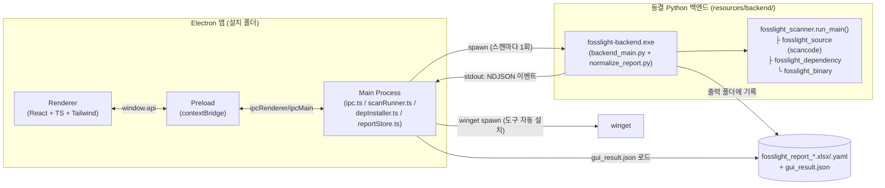

# 01. 아키텍처 개요

## 목표

FOSSLight Scanner(CLI)를 비개발자도 쓸 수 있게 만드는 Windows 데스크톱 앱.
핵심 요구사항은 **인스톨러 하나로 설치 완결**(별도 Python/pip 설치 없음)과
사이드바형 모던 UI.

## 전체 구조



## 기술 스택

| 계층 | 선택 | 이유 |
|---|---|---|
| 데스크톱 셸 | Electron 39 + electron-vite | 사이드바형 웹 UI 구현이 쉽고 NSIS 패키징(electron-builder) 성숙 |
| UI | React 19 + TypeScript + Tailwind CSS v4 | 컴포넌트 라이브러리 없이 미니멀 스타일 직접 구현 |
| 상태 관리 | zustand | 스토어 하나로 충분한 규모 |
| 테이블 | @tanstack/react-table (headless) | 검색/정렬/페이지네이션 무료 제공, 스타일 자유 |
| 차트 | recharts | Overview의 도넛/바 차트 |
| 분석 엔진 | fosslight-scanner 2.1.25 (고정) | `run_main()` Python API 직접 호출 |
| 백엔드 동결 | PyInstaller 6.21+ **onedir** | scancode 데이터가 수백 MB라 onefile 부적합 |
| 인스톨러 | electron-builder NSIS | 백엔드를 extraResources로 포함 |

## 왜 "스캔마다 spawn" 인가 (상주 서버가 아니라)

- 스캔은 배치 작업 — 요청/응답 서버가 필요 없다.
- 포트/방화벽 프롬프트 없음 (Windows Defender가 리스닝 소켓에 경고를 띄우면 첫 실행 UX가 나쁨).
- **취소가 100% 확실**: 프로세스 트리를 `taskkill /T /F`로 죽이면 끝.
  fosslight에는 협조적 취소 API가 없다.
- 크래시 격리: scancode가 죽어도 앱은 살아있다.

## 왜 결과를 파일(gui_result.json)로 주고받나

- 백엔드가 fosslight의 xlsx 리포트를 파싱해 **안정된 스키마로 정규화**한 뒤 파일로 남긴다.
- fosslight 출력 형식이 바뀌어도 Python 래퍼만 수정하면 되고, 렌더러는 영향 없다.
- 파일이 사용자 지정 출력 폴더에 남으므로 "최근 스캔 자동 로드"가 공짜로 된다.

## 디렉토리 구조

```
fosslight_scanner_gui (newapp)
├── src/
│   ├── main/                  # Electron main 프로세스
│   │   ├── index.ts           #   앱 시동, 윈도우 생성
│   │   ├── ipc.ts             #   IPC 핸들러 (스캔 세션 오케스트레이션)
│   │   ├── scanRunner.ts      #   백엔드 spawn / NDJSON 파싱 / 취소
│   │   ├── depInstaller.ts    #   패키지 매니저 자동 설치 (winget)
│   │   └── reportStore.ts     #   gui_result.json 로드, 최근 스캔 목록
│   ├── preload/index.ts       # contextBridge로 window.api 노출
│   ├── renderer/src/          # React 앱
│   │   ├── pages/             #   Overview / Scan / Results / LicenseRisk / Vulnerability
│   │   ├── components/        #   Sidebar / DataTable / Badge / StatCard ...
│   │   ├── store/appStore.ts  #   zustand 스토어 (report, 스캔 상태, 폼)
│   │   ├── utils/             #   licenseMatcher, nvdLink
│   │   └── data/licenses.ko.json  # 라이선스 위험도/의무사항 데이터셋
│   └── shared/types.ts        # main·preload·renderer 공유 타입 (IPC 계약)
├── python-backend/
│   ├── src/backend_main.py    # 스캔 래퍼 (NDJSON 프로토콜)
│   ├── src/normalize_report.py# xlsx → gui_result.json 정규화
│   ├── fosslight_backend.spec # PyInstaller 설정 (함정 주석 포함)
│   ├── requirements.txt       # fosslight-scanner==2.1.25 버전 고정
│   └── RECON.md               # fosslight 실측 문서 (필독!)
├── scripts/build-backend.ps1  # venv + PyInstaller 빌드
├── test-fixtures/             # 검증용 샘플 (npm/python/flutter 프로젝트, 압축본)
├── docs/                      # 이 문서들
├── electron-builder.yml       # NSIS 패키징 (backend를 extraResources로)
└── INSTALL.md                 # 최종 사용자용 설치 안내
```

## 프로세스/데이터 경계 요약

| 위치 | 역할 | 실패 시 |
|---|---|---|
| Renderer | 표시와 입력만. 파일/프로세스 접근 없음 | — |
| Main | 파일 대화상자, 백엔드/도구 프로세스 관리, 리포트 파일 로드 | 스캔 세션 플래그 해제 |
| Backend | fosslight 실행, 결과 정규화, 임시 폴더 정리 | NDJSON error 이벤트 + exit≠0 |

## 더 읽기

- 스캔 한 번이 정확히 어떻게 흘러가는지 → [02. 스캔 실행 흐름](02-scan-flow.md)
- fosslight 특유의 함정(포맷 순서, Windows rmtree 등) → [03. Python 백엔드](03-backend.md)와
  [python-backend/RECON.md](../python-backend/RECON.md)
