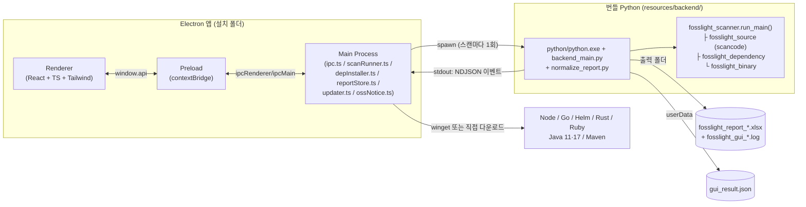

# 01. 아키텍처 개요

## 목표

FOSSLight Scanner(CLI)를 비개발자도 쓸 수 있게 만드는 Windows 데스크톱 앱.
핵심 요구사항은 **인스톨러 하나로 설치 완결**(별도 Python/pip 설치 없음)과
사이드바형 모던 UI.

## 전체 구조


```mermaid
flowchart LR
    subgraph Electron["Electron 앱 (설치 폴더)"]
        R["Renderer<br/>(React + TS + Tailwind)"]
        P["Preload<br/>(contextBridge)"]
        M["Main Process<br/>(ipc.ts / scanRunner.ts /<br/>depInstaller.ts / reportStore.ts /<br/>updater.ts / ossNotice.ts)"]
        R <-->|window.api| P
        P <-->|ipcRenderer/ipcMain| M
    end

    subgraph Backend["번들 Python (resources/backend/)"]
        B["python/python.exe + backend_main.py<br/>+ normalize_report.py"]
        F["fosslight_scanner.run_main()<br/>├ fosslight_source (scancode)<br/>├ fosslight_dependency<br/>└ fosslight_binary"]
        B --> F
    end

    M -->|"spawn (스캔마다 1회)"| B
    B -->|"stdout: NDJSON 이벤트"| M
    B -->|"출력 폴더"| OUT[("fosslight_report_*.xlsx<br/>+ fosslight_gui_*.log")]
    B -->|"userData"| JSON[("gui_result.json")]
    M -->|"winget 또는 직접 다운로드"| W["Node / Go / Helm / Rust / Ruby<br/>Java 11·17 / Maven"]
```

## 기술 스택

| 계층 | 선택 | 이유 |
|---|---|---|
| 데스크톱 셸 | Electron 39 + electron-vite | 사이드바형 웹 UI 구현이 쉽고 NSIS 패키징(electron-builder) 성숙 |
| UI | React 19 + TypeScript + Tailwind CSS v4 | 컴포넌트 라이브러리 없이 미니멀 스타일 직접 구현 |
| 상태 관리 | zustand | 스토어 하나로 충분한 규모 |
| 테이블 | @tanstack/react-table (headless) | 검색/정렬/페이지네이션 무료 제공, 스타일 자유 |
| 차트 | recharts | Overview의 도넛/바 차트 |
| 분석 엔진 | fosslight-scanner 2.1.32 이상, dependency 4.1.56 이상, util 2.2.16 이상 | `run_main()` Python API 직접 호출. 하한은 Windows 보정에 필요한 상류 수정이 들어간 버전 |
| 백엔드 배포 | 독립 CPython 3.12 (`python-build-standalone`) + pip | pypi 분석용 venv를 같은 인터프리터로 만들 수 있다. PyInstaller onefile/onedir는 사용하지 않는다 |
| 인스톨러 | electron-builder NSIS | `python-backend/pybuild`를 extraResources로 포함 |
| 업데이트 | electron-updater | 시작 시 GitHub Release를 확인하고, 사용자가 고르면 다운로드 후 재설치 |

`python-backend/fosslight_backend.spec`와 `requirements.txt`의 PyInstaller 핀은 예전 동결 빌드의 잔여물이다. `scripts/build-backend.ps1`은 spec을 호출하지 않는다.

## 왜 "스캔마다 spawn" 인가 (상주 서버가 아니라)

- 스캔은 배치 작업 — 요청/응답 서버가 필요 없다.
- 포트/방화벽 프롬프트 없음 (Windows Defender가 리스닝 소켓에 경고를 띄우면 첫 실행 UX가 나쁨).
- **취소가 100% 확실**: 프로세스 트리를 `taskkill /T /F`로 죽이면 끝.
  fosslight에는 협조적 취소 API가 없다.
- 크래시 격리: scancode가 죽어도 앱은 살아있다.

## 왜 결과를 파일(gui_result.json)로 주고받나

- 백엔드가 fosslight의 xlsx 리포트를 파싱해 **안정된 스키마로 정규화**한 뒤 파일로 남긴다.
- fosslight 출력 형식이 바뀌어도 Python 래퍼만 수정하면 되고, 렌더러는 영향 없다.
- 저장 위치는 `%APPDATA%\fosslight-scanner-gui\gui_result.json`이다. 설치 폴더가
  쓰기 불가일 수 있어 userData를 쓴다. 최근 스캔 목록(`recent-scans.json`)이 이 경로를 가리킨다.
- 성공한 `result` 이벤트에는 같은 JSON이 함께 실리므로, 렌더러는 파일을 다시 열지 않고 바로 표시한다.

## 디렉토리 구조

```
fosslight_scanner_gui
├── src/
│   ├── main/                  # Electron main 프로세스
│   │   ├── index.ts           #   앱 시동, 윈도우 생성, 업데이터 초기화
│   │   ├── ipc.ts             #   IPC 핸들러 (스캔 세션 오케스트레이션)
│   │   ├── scanRunner.ts      #   백엔드 spawn / NDJSON 파싱 / 취소 / 사전 다운로드
│   │   ├── depInstaller.ts    #   패키지 매니저·Java·Maven 준비
│   │   ├── reportStore.ts     #   gui_result.json 로드, 최근 스캔 목록
│   │   ├── updater.ts         #   GitHub Release 업데이트
│   │   └── ossNotice.ts       #   앱에 포함된 OSS Notice 열기
│   ├── preload/index.ts       # contextBridge로 window.api 노출
│   ├── renderer/src/          # React 앱
│   │   ├── pages/             #   Overview / Scan / Results / LicenseRisk
│   │   │                      #   VulnerabilityPage.tsx는 남아 있으나 라우트·메뉴에서 숨김
│   │   ├── components/        #   Sidebar / DataTable / Badge / StatCard ...
│   │   ├── store/appStore.ts  #   zustand 스토어 (report, 스캔 상태, 폼)
│   │   ├── utils/             #   licenseMatcher, nvdLink
│   │   └── data/licenses.ko.json  # 라이선스 위험도/의무사항 데이터셋
│   └── shared/types.ts        # main·preload·renderer 공유 타입 (IPC 계약)
├── python-backend/
│   ├── src/backend_main.py    # 스캔 래퍼 (NDJSON 프로토콜)
│   ├── src/normalize_report.py# xlsx → gui_result.json 정규화
│   ├── requirements.txt       # 개발 venv용. 엔진 하한 + 미사용 PyInstaller 핀
│   ├── fosslight_backend.spec # 사용하지 않는 예전 PyInstaller 설정
│   └── RECON.md               # fosslight 실측 문서
├── scripts/build-backend.ps1  # 독립 Python + fosslight 설치 → pybuild/
├── scripts/run-regression.py  # 상류 업데이트 후 검출 건수 회귀 검사
├── .github/workflows/release.yml
├── docs/                      # 이 문서들
└── electron-builder.yml       # NSIS 패키징 (pybuild를 extraResources로)
```

`python-backend/pybuild/`는 `npm run build:backend` 산출물이며 저장소에 커밋하지 않는다.

## 프로세스/데이터 경계 요약

| 위치 | 역할 | 실패 시 |
|---|---|---|
| Renderer | 표시와 입력만. 파일/프로세스 접근 없음 | — |
| Main | 파일 대화상자, 백엔드/도구 프로세스 관리, 리포트 파일 로드, 업데이트 | 스캔 세션 플래그 해제 |
| Backend | fosslight 실행, 결과 정규화, 임시 폴더 정리, URL/압축 사전 해제 | NDJSON error 이벤트 + exit≠0 |

## 더 읽기

- 스캔 한 번이 정확히 어떻게 흘러가는지 → [02. 스캔 실행 흐름](02-scan-flow.md)
- fosslight 호출 규약과 정규화 → [03. Python 백엔드](03-backend.md)
