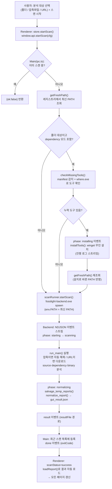
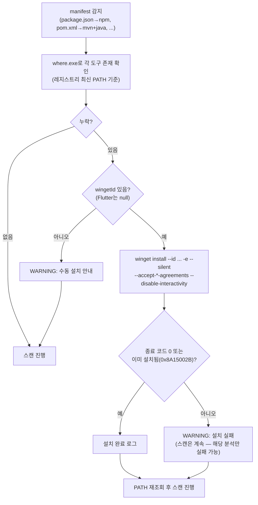
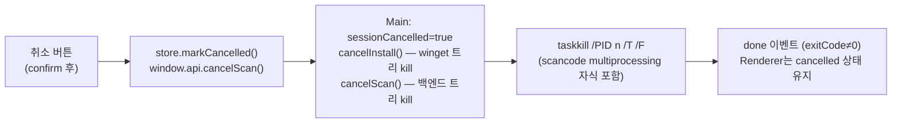

# 02. 스캔 실행 흐름

스캔 버튼을 누른 순간부터 결과 화면까지의 전체 흐름입니다.
코드 기준: `src/renderer/src/pages/ScanPage.tsx` → `src/main/ipc.ts` →
`src/main/depInstaller.ts` → `src/main/scanRunner.ts` → `python-backend/src/backend_main.py`

## 전체 플로우차트

## NDJSON 이벤트 프로토콜 (Backend stdout → Main)

백엔드 stdout은 **순수 NDJSON 채널**입니다 (한 줄 = 한 이벤트, UTF-8).
fosslight의 콘솔 출력은 stderr로 우회시키고, JSON 파싱에 실패하는 줄은 무시합니다.

| 이벤트 | 필드 | 의미 |
|---|---|---|
| `phase` | `phase: starting\|scanning\|normalizing` | 단계 전환 (UI 스테퍼) |
| `log` | `level`, `message` | fosslight 로거 출력 전달 (로그 콘솔 표시) |
| `error` | `message`, `traceback` | 치명 오류 (빨간 배너) |
| `result` | `resultFile` | 정규화 결과 파일 경로 (성공 시 1회) |
| `done` | `exitCode` | **Main이 프로세스 종료 시 합성** (백엔드가 보내지 않음) |

`installing` phase는 Main(depInstaller)이 직접 보냅니다 — 백엔드 실행 전 단계이기 때문.

## 도구 자동 설치 흐름 (depInstaller.ts)

- 설치 실패는 스캔을 막지 않습니다. 의존성 분석만 실패할 수 있고 경고로 안내합니다.
- **압축파일/URL 대상은 사전 감지 불가** (해제/다운로드 전) → 백엔드의 경고 이벤트로만 안내.
- 설치 후 앱 재시작이 필요 없는 이유: spawn 시 `env.PATH`를 레지스트리에서
  새로 읽은 값으로 넘기기 때문 (`getFreshPath()`).

## 취소 흐름

- 프로세스 **트리** 전체를 죽이는 것이 중요합니다 — scancode가 multiprocessing
  워커를 여러 개 만들기 때문. (`/T` 플래그)
- 취소 후 남는 부분 출력 파일은 무해합니다. `gui_result.json`은 마지막에 쓰이므로
  "이 파일이 없으면 미완료 스캔"으로 판별됩니다.

## 성공/실패 판정 (중요)

fosslight의 `run_main` 반환값은 신뢰할 수 없습니다 (스캔 성공 후 임시 파일 정리
예외에도 False 반환). 백엔드 래퍼의 실제 판정 규칙:

1. `Download failed` 로그 감지 → **실패** ("다운로드에 실패했습니다")
2. 이번 스캔에서 생성된 `fosslight_report_*.xlsx`가 출력 폴더에 존재 → **성공**
   (`run_main`이 False여도)
3. 리포트도 없고 run_main이 False → **실패**
4. 리포트가 없지만 run_main이 True → **0건 성공** (검출 없음 — fosslight는 0건이면
   리포트 파일 자체를 안 만듦)

상세 근거는 [03. Python 백엔드](03-backend.md)와 [RECON.md](../python-backend/RECON.md) 참고.

## 오류가 사용자에게 보이는 방식

| 상황 | UI |
|---|---|
| `error` 이벤트 / exit≠0 | 스캔 폼의 빨간 배너 (`errorMessage`) |
| `WARNING` 로그 중 "설치되어 있지 않아" 포함 | 스캔 페이지 상단 앰버 배너 (`warnings`) |
| 일반 log 이벤트 | 진행 화면의 로그 콘솔 (최근 500줄) |
| 취소 | 회색 "스캔이 취소되었습니다" 배너 |
