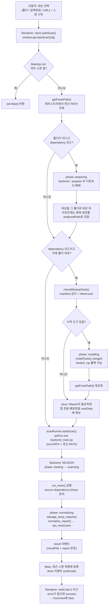
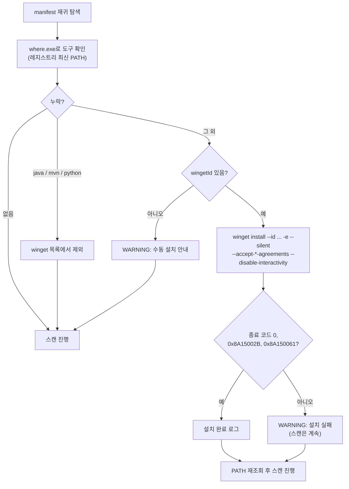
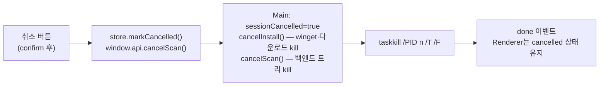

# 02. 스캔 실행 흐름

스캔 버튼을 누른 순간부터 결과 화면까지의 전체 흐름입니다.
코드 기준: `src/renderer/src/pages/ScanPage.tsx` → `src/main/ipc.ts` →
`src/main/depInstaller.ts` → `src/main/scanRunner.ts` → `python-backend/src/backend_main.py`

## 전체 플로우차트

```mermaid
flowchart TD
    A["사용자: 대상 선택<br/>(폴더 / 압축파일 / URL) + 스캔 시작"] --> B["Renderer: store.startScan()<br/>window.api.startScan(cfg)"]
    B --> C{"Main(ipc.ts):<br/>이미 스캔 중?"}
    C -- 예 --> C1["{ok:false} 반환"]
    C -- 아니오 --> D["getFreshPath()<br/>레지스트리에서 최신 PATH 조회"]
    D --> E{"폴더가 아니고<br/>dependency 모드?"}
    E -- 예 --> E1["phase: preparing<br/>backend --prepare 로 다운로드/해제"]
    E1 --> E2["대상을 그 폴더로 바꾼 뒤<br/>리포트에는 원래 경로를 analyzedPath로 전달"]
    E -- 아니오 --> F
    E2 --> F{"dependency 모드이고<br/>이제 폴더 대상?"}
    F -- 아니오 --> H
    F -- 예 --> G["checkMissingTools()<br/>manifest 감지 + where.exe"]
    G --> G0{"누락 도구 있음?"}
    G0 -- 예 --> G1["phase: installing<br/>installTools() (winget)<br/>Node는 zip 폴백 가능"]
    G0 -- 아니오 --> G3
    G1 --> G2["getFreshPath() 재조회"]
    G2 --> G3["Java / Maven이 필요하면<br/>앱 전용 배포판을 userData에 확보"]
    G3 --> H["scanRunner.startScan():<br/>python.exe backend_main.py<br/>(env.PATH = 최신 PATH)"]

    H --> I["Backend: NDJSON<br/>phase: starting → scanning"]
    I --> J["run_main() 실행<br/>source·dependency·binary 분석"]
    J --> K["phase: normalizing<br/>salvage_temp_reports()<br/>normalize_report() → gui_result.json"]
    K --> L["result 이벤트<br/>(resultFile + report 본문)"]
    L --> M["Main: 최근 스캔 목록에 등록<br/>done 이벤트 (exitCode)"]
    M --> N["Renderer: exitCode 0 이고<br/>error가 없으면 success<br/>→ Overview에 New"]
```

폴더가 아닌 대상이라도 Dependency를 끄면 `--prepare`를 하지 않는다. 그때는 백엔드의 `run_main()`이 압축 해제와 URL 다운로드를 직접 한다.

## NDJSON 이벤트 프로토콜 (Backend stdout → Main)

백엔드 stdout은 **순수 NDJSON 채널**입니다 (한 줄 = 한 이벤트, UTF-8).
fosslight의 콘솔 출력은 stderr로 우회시키고, JSON 파싱에 실패하는 줄은 무시합니다.
로그가 많으면 Main이 `log`를 모아 `log-batch`로 렌더러에 보냅니다.

| 이벤트 | 필드 | 의미 |
|---|---|---|
| `phase` | `phase`, `modes?` | 단계 전환. 백엔드는 `starting` / `scanning` / `normalizing`. Main은 그 전에 `preparing` / `installing`을 보낸다 |
| `log` | `level`, `message` | fosslight 로거 출력 전달 |
| `log-batch` | `entries[]` | Main이 모은 로그. 렌더러 처리 방식은 `log`와 같다 |
| `error` | `message`, `traceback` | 치명 오류 (빨간 배너) |
| `result` | `resultFile`, `report?` | 정규화 결과. `report`가 있으면 렌더러가 그 객체를 바로 표시한다 |
| `prepared` | `success`, `path`, `message` | `--prepare` 전용. 스캔 프로토콜이 아니라 사전 다운로드 결과 |
| `done` | `exitCode` | **Main이 프로세스 종료 시 합성** (백엔드가 보내지 않음). 준비/설치 단계에서 취소·실패하면 백엔드를 띄우기 전에도 Main이 `done`을 보낸다 |

UI 스테퍼 라벨은 `preparing` 다운로드, `installing` 도구 설치, `starting` 준비, `scanning` 분석, `normalizing` 결과 정리이다.

## 도구 자동 설치 흐름 (depInstaller.ts)

Dependency가 포함된 스캔에서, 대상이 폴더가 된 뒤에 manifest를 본다. URL과 압축 파일은 `--prepare`로 받은 폴더를 같은 함수에 넣는다.

```mermaid
flowchart TD
    A["manifest 재귀 탐색"] --> B["where.exe로 도구 확인<br/>(레지스트리 최신 PATH)"]
    B --> C{누락?}
    C -- 없음 --> Z[스캔 진행]
    C -- java / mvn / python --> C1["winget 목록에서 제외"]
    C1 --> Z
    C -- 그 외 --> D{"wingetId 있음?"}
    D -- 아니오 --> D1["WARNING: 수동 설치 안내"] --> Z
    D -- 예 --> E["winget install --id ... -e --silent<br/>--accept-*-agreements --disable-interactivity"]
    E --> F{"종료 코드 0,<br/>0x8A15002B, 0x8A150061?"}
    F -- 예 --> G["설치 완료 로그"] --> H["PATH 재조회 후 스캔 진행"]
    F -- 아니오 --> I["WARNING: 설치 실패<br/>(스캔은 계속)"] --> H
```

| 감지 파일 | 동작 |
|---|---|
| package.json | Node.js LTS를 winget으로 설치. winget을 쓸 수 없거나 PATH에 없으면 공식 zip을 받아 이번 분석에만 사용 |
| pom.xml | 시스템 `mvn`이나 `mvnw`가 없으면 Apache Maven 3.9.9를 직접 받는다. Java도 필요 |
| build.gradle, build.gradle.kts | Gradle은 설치하지 않는다. 프로젝트 wrapper를 쓰고, Java가 없으면 Temurin 11 JRE를 받는다. `gradle/libs.versions.toml`이 있으면 Temurin 17 JDK |
| requirements.txt, setup.py, setup.cfg, pyproject.toml, Pipfile | 번들 Python 3.12가 venv를 만든다. 별도 Python을 설치하지 않는다 |
| go.mod / Chart.yaml / Cargo.toml / Gemfile | winget으로 Go / Helm / Rustup / Ruby |
| pubspec.yaml | 자동 설치 없음. Flutter 수동 설치 안내 |
| Podfile, Podfile.lock | Windows 미지원 안내. CocoaPods는 설치하지 않는다 |

- 설치 실패는 스캔을 막지 않습니다. 그 패키지 매니저 분석만 실패할 수 있고 경고로 안내합니다.
- 설치 후 앱 재시작이 필요 없는 이유: spawn 시 `env.PATH`를 레지스트리에서 새로 읽은 값으로 넘기기 때문 (`getFreshPath()`).
- Java·Maven 배포판은 `%APPDATA%\fosslight-scanner-gui` 아래에 두고, 스캔 프로세스의 `JAVA_HOME` / `PATH`로만 넘긴다.

## 취소 흐름

```mermaid
flowchart LR
    A["취소 버튼<br/>(confirm 후)"] --> B["store.markCancelled()<br/>window.api.cancelScan()"]
    B --> C["Main: sessionCancelled=true<br/>cancelInstall() — winget·다운로드 kill<br/>cancelScan() — 백엔드 트리 kill"]
    C --> D["taskkill /PID n /T /F"]
    D --> E["done 이벤트<br/>Renderer는 cancelled 상태 유지"]
```

- `--prepare` 중인 백엔드도 `currentChild`라서 같은 취소로 죽는다.
- 취소 후 `handleScanEvent`는 `done` 이외의 이벤트를 무시하고, `done`이 와도 `cancelled`를 `error`로 바꾸지 않는다.
- `gui_result.json`은 정규화가 끝난 뒤에만 쓰이므로, 파일이 갱신되지 않은 취소 스캔은 이전 성공 결과를 유지한다.

## 성공/실패 판정

백엔드는 `run_main` 반환값을 그대로 쓴다.

1. `run_main`이 `False` → **실패**. URL이면 "다운로드에 실패했습니다", 그 외에는 "스캔이 실패했습니다". 이때 xlsx가 있어도 성공으로 뒤집지 않는다.
2. `run_main`이 예외 없이 끝나면 `normalize_report()`를 호출한다. xlsx가 없으면 **빈 items로 성공**한다. fosslight는 검출 0건이면 리포트 파일을 만들지 않는다.
3. xlsx는 있는데 아는 시트(`SRC_FL_Source`, `BIN_FL_Binary`, `DEP_FL_Dependency`)가 하나도 없고 모르는 시트만 있으면 **실패**한다. 0건으로 숨기지 않기 위해서다.
4. 렌더러는 `done.exitCode === 0`이고 그 전에 `error`가 없을 때만 `success`다.

래퍼가 `run_main`에 넘기는 출력 형식은 `["excel"]`이다. yaml은 요청하지 않는다.

## 오류가 사용자에게 보이는 방식

| 상황 | UI |
|---|---|
| `error` 이벤트 / exit≠0 | 스캔 폼의 빨간 배너 (`errorMessage`)와 실패 토스트 |
| `WARNING` 로그 중 "설치되어 있지 않아" 포함 | 스캔 페이지 상단 앰버 배너 (`warnings`) |
| 일반 log 이벤트 | 진행 화면의 로그 콘솔 (최근 500줄). 출력 폴더의 `fosslight_gui_<시각>.log`에 같은 내용 |
| 취소 | 회색 "스캔이 취소되었습니다" 배너 |
| exit≠0 | 화면에는 없던 stderr 꼬리를 로그 파일 말미에 붙인다 (최대 64KB) |
