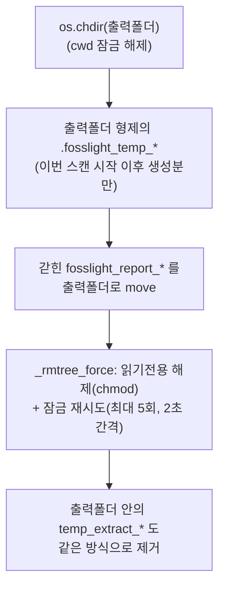

# 03. Python 백엔드

코드: `python-backend/src/backend_main.py`, `python-backend/src/normalize_report.py`
실측 기록: [python-backend/RECON.md](../python-backend/RECON.md) — **fosslight 관련 작업 전 필독**

## 역할

Electron이 스캔마다 spawn하는 CLI 프로세스입니다. 세 가지 일을 합니다.

1. `fosslight_scanner.run_main()` 호출 (폴더/압축/URL 처리는 fosslight가 자체 수행)
2. 진행 상황을 **stdout NDJSON**으로 스트리밍
3. fosslight의 xlsx 리포트를 **gui_result.json**으로 정규화

## CLI 인터페이스

```
fosslight-backend.exe (--path <폴더|압축파일> | --url <git/다운로드 URL>)
                      --modes all|source,dependency,binary
                      [--exclude a;b;c] --output <폴더>
                      [--debug-source]   # 동결 환경 진단용 (숨김)
```

## 시동 시퀀스 (순서가 중요)

```python
sys.stdout.reconfigure(encoding="utf-8")  # ① Windows 파이프 기본 cp949 → 한글 깨짐 방지
REAL_STDOUT = sys.stdout                  # ② NDJSON 전용 채널 확보
sys.stdout = sys.stderr                   # ③ 이후 모든 print/로거 출력은 stderr로
# ... fosslight 임포트는 반드시 이 뒤에 (로거 핸들러가 스트림에 바인딩되므로)

if __name__ == "__main__":
    multiprocessing.freeze_support()      # ④ 필수! 없으면 동결 exe가 무한 재실행
    main()
```

- fosslight 로거("FOSSLight")에 커스텀 핸들러(`NdjsonLogHandler`)를 달아 로그를
  이벤트로 변환합니다. 핸들러를 먼저 달면 fosslight `init_log`의 `hasHandlers` 분기가
  건너뛰어지므로 **`logger.setLevel(INFO)`를 직접** 지정해야 진행 로그가 나옵니다.
- `os.chdir(출력폴더)`: fosslight가 `.fosslight_temp_*`, `temp_extract_*`를 cwd에
  만들기 때문 (설치 폴더는 Program Files라 쓰기 불가).

## run_main 호출 규약

```python
ok = run_main(
    mode_list,          # ["all"] 또는 ["source", ...]
    [args.path or ""],  # 압축파일 경로면 fosslight가 자동 해제
    [],                 # dep_arguments
    args.output,
    ["excel", "yaml"],  # ★ 첫 항목이 excel이 아니면 빈 결과 (v2.1.25 버그)
    args.url or "",     # URL이면 fosslight가 git clone/wget 다운로드
    "",                 # db_url
    hide_progressbar=True,   # ★ 진행 바 \r 출력이 NDJSON 오염 방지
    path_to_exclude=exclude_list,
)
```

## Windows 정리 실패 연쇄와 복구 (salvage_temp_reports)

fosslight는 스캔 후 임시 폴더를 `shutil.rmtree`로 지우는데 Windows에서 자주 실패합니다:

| 원인 | 증상 |
|---|---|
| git clone된 `.git`의 읽기 전용 파일 | rmtree 예외 → **최종 리포트가 `.fosslight_temp_*`에 갇힘** (이동 코드까지 도달 못함) |
| 의존성 분석 venv(`venv_osc_dep_tmp`) 파일 잠금 | 위와 동일 + `temp_extract_*` 잔류 |
| fosslight_dependency가 분석 폴더로 `os.chdir` 후 미복귀 | **자기 자신의 cwd**가 삭제를 막음 (WinError 32) |

래퍼의 `salvage_temp_reports()`가 스캔 후 복구합니다:



또한 이 정리 실패 시 fosslight가 남기는 `[WinError 32] ...` WARNING은 사용자에게
실패로 오해되므로, `NdjsonLogHandler`가 걸러서 "앱이 대신 정리합니다" INFO로 바꿉니다.
(경로 마커 `temp_extract_`/`.fosslight_temp_`/`venv_osc_dep_tmp` 포함 시에만 — 다른
WinError 32는 그대로 노출)

## 성공/실패 판정

`run_main` 반환값만으로 판정하면 안 됩니다 (정리 예외에도 False). 규칙은
[02. 스캔 실행 흐름](02-scan-flow.md#성공실패-판정-중요) 참고. 코드상으로는:

```python
if ndjson_handler.download_failed:        # "Download failed" 로그 감지
    raise RuntimeError("다운로드에 실패했습니다...")
reports_exist = any(mtime >= scan_started_at for ...fosslight_report_*.xlsx)
if ok is False and not reports_exist:
    raise RuntimeError("스캔이 실패했습니다...")
```

## gui_result.json 스키마

`normalize_report()`가 최신 `fosslight_report_*.xlsx`를 파싱해 생성합니다.
시트 매핑: `SRC_FL_Source→source`, `BIN_FL_Binary→binary`, `DEP_FL_Dependency→dependency`.

```jsonc
{
  "scanDate": "2026-07-06T01:23:45",
  "analyzedPath": "D:\\proj 또는 압축경로 또는 URL",
  "modes": ["all"],
  "toolInfo": { "Tool information": "fosslight_scanner v2.1.25 (...)", ... },
  "items": {
    "source":     [ /* OssItem[] */ ],
    "dependency": [ ... ],
    "binary":     [ ... ]
  }
}
```

OssItem (모든 필드 문자열, license만 배열):

| 필드 | 원본 xlsx 컬럼 | 비고 |
|---|---|---|
| `name` / `version` | OSS Name / OSS Version | dep는 `npm:accepts` 형태 프리픽스 |
| `license` | License | 쉼표 구분 → 배열 |
| `downloadLocation` / `homepage` / `copyright` / `comment` | 동명 컬럼 | |
| `exclude` | Exclude | 값 존재 여부 → bool |
| `paths` | Source Path / Binary Path / Package URL | 시트별로 다른 컬럼 |

- 검출 0건이면 fosslight가 리포트 파일을 안 만듦 → **빈 items로 성공 처리** (오류 아님).
- NVD 취약점 링크는 여기 없음 — 렌더러(`utils/nvdLink.ts`)가 name/version으로 생성
  (NVD URL 형식이 바뀌어도 앱만 업데이트하면 되도록).

## PyInstaller 동결 (fosslight_backend.spec)

- **onedir 고정** (onefile 금지 — 실행마다 수백 MB 압축 해제 + AV 오탐).
- scancode는 entry point로 플러그인을 찾으므로 `copy_metadata`(dist 메타데이터)와
  `collect_all`(모듈 본체+데이터) **둘 다** 필요. 누락 시 source 분석만
  "[WinError 2]"로 조용히 실패.
- 필수 hiddenimports: `intbitset_helper`, `intbitset_version`, `ahocorasick`.
- numpy 2.5는 PyInstaller **6.21+** 필요.
- 새 누락 모듈 진단법: `fosslight-backend.exe --debug-source` — source 스캐너를
  직접 호출해 전체 traceback을 얻는다 (fosslight는 이 예외를 삼키므로).
- 상세 이력: [RECON.md](../python-backend/RECON.md)의 "PyInstaller 동결 트러블슈팅".

## 알려진 fosslight 업스트림 버그 (이슈 리포팅 후보)

1. `-f`의 첫 포맷이 excel이 아니면 모든 분석이 빈 결과 (내부 raw 파일 확장자 불일치)
2. npm registry tgz URL 변형 오류 (`ms-2.1.3.tgz` → `ms-ms-2.1.3.tgz.tgz`)
3. Windows rmtree 실패 연쇄 (위 참조) — 실패가 debug 레벨로 삼켜져 원인 파악 어려움
4. URL 다운로드 실패 시에도 run_main이 True 반환
