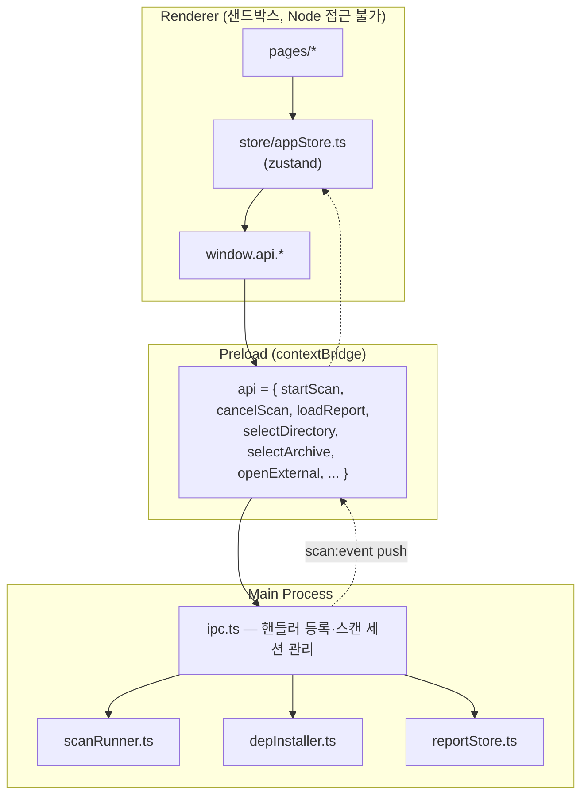
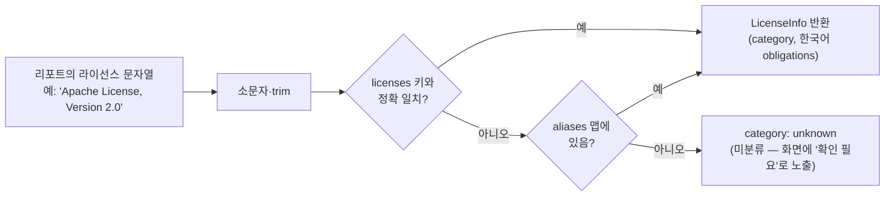

# 04. 프론트엔드 (Electron / React)

## 프로세스 3계층

렌더러는 파일/프로세스에 직접 접근하지 않습니다. 모든 부수효과는 `window.api`
(preload가 노출) 뒤의 main 프로세스에서 일어납니다.

## IPC 채널 목록 (계약: src/shared/types.ts)

| 채널 | 방식 | 페이로드 → 반환 |
|---|---|---|
| `scan:start` | invoke | `ScanConfig` → `{ok, message?}` (도구 설치까지 오케스트레이션) |
| `scan:cancel` | invoke | — (설치·스캔 프로세스 트리 kill) |
| `scan:isRunning` | invoke | → boolean (설치 단계 포함) |
| `scan:event` | main→renderer | `ScanEvent` 스트림 (phase/log/error/result/done) |
| `report:load` | invoke | `resultFile?` → `GuiResult \| null` (생략 시 최근 스캔) |
| `report:recent` | invoke | → `RecentScan[]` (존재하는 파일만 필터) |
| `dialog:selectDir` / `dialog:selectArchive` | invoke | → 경로 \| null |
| `shell:openExternal` | invoke | http/https URL만 허용 |
| `app:version` | invoke | → package.json 버전 (사이드바 표시) |

`ScanConfig`: `{ targetType: 'folder'|'archive'|'url', target, modes[], excludePaths[], outputDir }`

## 상태 관리 (store/appStore.ts)

zustand 스토어 하나에 전부 들어 있습니다:

| 상태 | 용도 |
|---|---|
| `report: GuiResult \| null` | 모든 결과 페이지의 데이터 원천 |
| `scanStatus: idle\|running\|success\|error\|cancelled` | 스캔 폼/진행 화면 전환 |
| `scanPhase`, `logLines(≤500)`, `warnings`, `errorMessage` | 진행 화면 표시 |
| `form { targetType, target, modes, excludePaths, outputDir }` | 페이지 이동에도 유지되는 스캔 폼 |

이벤트 반영은 `handleScanEvent` 하나로 집중: `App.tsx`가 mount 시
`window.api.onScanEvent(handleScanEvent)`를 1회 구독하고, 스캔 성공 시 `ScanPage`의
effect가 `loadReport()`로 report를 갱신합니다. 앱 시작 시에도 최근 스캔을 자동 로드합니다.

## 페이지 구성 (HashRouter)

| 라우트 | 페이지 | 핵심 로직 |
|---|---|---|
| `/` | OverviewPage | 섹션 3개: Open Source 검출(카드) / License 정보(위험도 도넛·상위 라이선스 바·고위험 배너) / 보안취약점 요약. 모든 통계는 `exclude` 항목 제외 후 계산 |
| `/scan` | ScanPage | 대상 유형 세그먼트(폴더/압축/URL), 유효성 검사, 진행 스테퍼(도구 설치→준비→분석→결과 정리), 로그 콘솔, 취소 |
| `/results/:scanner` | ResultsPage | source/dependency/binary 공용 — `SCANNER_META`로 제목/경로 컬럼만 분기 |
| `/risk/license` | LicenseRiskPage | 라이선스별 그룹화 → 위험도순 정렬, 행 확장 시 사용 항목 목록 |
| `/risk/vulnerability` | VulnerabilityPage | `name` 있는 항목만 표시, NVD 검색 버튼 |

공용 컴포넌트: `DataTable`(TanStack 기반 — 전역 검색/정렬/50행 페이지네이션/행 확장/
exclude 흐림 처리), `Sidebar`(검출 건수 배지, 하단에 앱 버전+GitHub 이슈 링크),
`EmptyState`, `StatCard`, `Badge`, `PageHeader`.

## 라이선스 위험도 분류 (utils/licenseMatcher.ts + data/licenses.ko.json)

- 데이터셋: 주요 라이선스 약 40종 + 표기 변형 alias. **미분류는 숨기지 않고**
  License Risk 페이지 상단에 "수동 검토 필요"로 드러냅니다.
- 분류: `permissive`(낮음) / `weak-copyleft`(중간) / `strong-copyleft`·`restricted`(높음) / `unknown`.
- 새 라이선스 추가는 `licenses.ko.json`에 항목/alias만 추가하면 됩니다 (코드 수정 불필요).

## NVD 취약점 링크 (utils/nvdLink.ts)

- 앱은 CVE를 직접 조회하지 않습니다 (오프라인 동작 보장). OSS 이름+버전으로
  NVD 검색 URL만 생성합니다.
- **NVD는 2026년 기준 SPA**라 URL 형식이 `https://nvd.nist.gov/vuln/search#/nvd/home?keyword=<검색어>&resultType=records`
  입니다. 구형 `/vuln/search/results?query=` 는 리다이렉트에서 검색어를 잃으므로 쓰면 안 됩니다.
- 링크를 (백엔드가 아닌) 렌더러에서 만들기 때문에, NVD가 또 바뀌면 이 파일 하나만
  고치고 `npm run dist:app-only`로 재배포하면 되고 기존 리포트 파일도 자동 수혜를 받습니다.

## 스타일 규칙

- Tailwind CSS v4 (`@theme`으로 `--color-accent`, `--color-sidebar` 등 토큰 정의 —
  `src/renderer/src/assets/main.css`). 컴포넌트 라이브러리 없음.
- 다크 사이드바 + 밝은 콘텐츠 영역, 카드형(rounded-xl + border + shadow-sm) 레이아웃.
- 표기: 메뉴/기술 용어는 영문(Overview, Source...), 설명·안내는 한국어.
