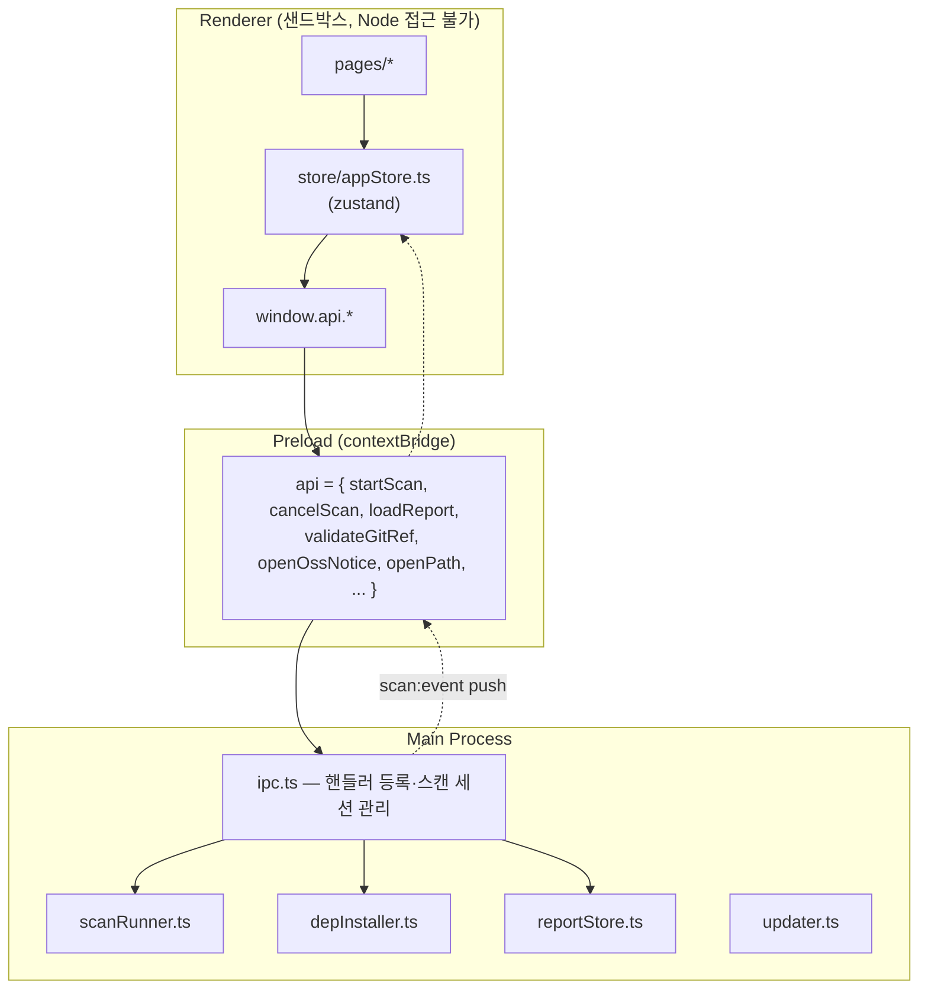
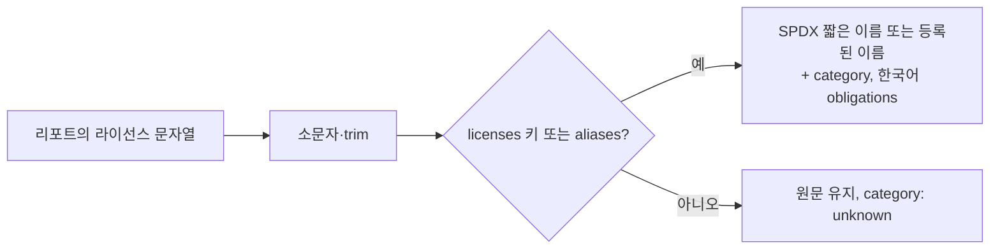

# 04. 프론트엔드 (Electron / React)

## 프로세스 3계층


```mermaid
flowchart TD
    subgraph Renderer["Renderer (샌드박스, Node 접근 불가)"]
        direction LR
        Pages["pages/*"] --> Store["store/appStore.ts<br/>(zustand)"]
        Store --> API["window.api.*"]
    end
    subgraph Preload["Preload (contextBridge)"]
        Bridge["api = { startScan, cancelScan, loadReport,<br/>validateGitRef, openOssNotice, openPath, ... }"]
    end
    subgraph Main["Main Process"]
        IPC["ipc.ts — 핸들러 등록·스캔 세션 관리"]
        SR["scanRunner.ts"]
        DI["depInstaller.ts"]
        RS["reportStore.ts"]
        UP["updater.ts"]
        IPC --> SR & DI & RS
    end
    API --> Bridge --> IPC
    IPC -.->|"scan:event push"| Bridge -.-> Store
```

렌더러는 파일/프로세스에 직접 접근하지 않습니다. 모든 부수효과는 `window.api`
(preload가 노출) 뒤의 main 프로세스에서 일어납니다.

## IPC 채널 목록 (계약: src/shared/types.ts)

| 채널 | 방식 | 페이로드 → 반환 |
|---|---|---|
| `scan:start` | invoke | `ScanConfig` → `{ok, message?}`. 사전 다운로드와 도구 설치까지 포함 |
| `scan:cancel` | invoke | 설치·다운로드·스캔 프로세스 트리 kill |
| `scan:isRunning` | invoke | → boolean (설치 단계 포함) |
| `scan:event` | main→renderer | `ScanEvent` 스트림 |
| `report:load` | invoke | `resultFile?` → `GuiResult \| null`. 생략 시 최근 스캔 |
| `report:recent` | invoke | → `RecentScan[]` (파일이 남아 있는 항목만) |
| `dialog:selectDir` / `dialog:selectArchive` | invoke | → 경로 \| null |
| `shell:openExternal` | invoke | http/https URL만 허용 |
| `shell:openPath` | invoke | 결과 폴더를 탐색기로 연다 |
| `shell:showInFolder` | invoke | 파일 위치를 탐색기에서 연다 |
| `app:version` | invoke | → package.json 버전 |
| `app:scannerVersions` | invoke | → 번들 fosslight 패키지 버전. 사이드바 툴팁 |
| `app:validateGitRef` | invoke | URL + ref → 브랜치/태그 검증 결과 |
| `app:openOssNotice` | invoke | 앱에 포함된 OSS Notice를 연다 |

`ScanConfig`:

```ts
{
  targetType: 'folder' | 'archive' | 'url'
  target: string
  gitRef?: string
  gitRefType?: 'branch' | 'tag' | null
  modes: Array<'source' | 'dependency' | 'binary'>
  excludePaths: string[]
  outputDir: string
  kbUrl?: string
  kbToken?: string
  analyzedPath?: string // URL/압축을 미리 푼 경우, 리포트에 적을 원래 대상
}
```

모드는 세 개 모두면 백엔드에 `all`로 전달한다.

## 상태 관리 (store/appStore.ts)

zustand 스토어 하나에 들어 있습니다.

| 상태 | 용도 |
|---|---|
| `report: GuiResult \| null` | 모든 결과 페이지의 데이터 원천. 넣기 전에 SPDX 짧은 이름으로 맞춘다 |
| `scanStatus: idle\|running\|success\|error\|cancelled` | 스캔 폼/진행 화면 전환 |
| `scanPhase`, `logLines`(최근 500줄), `warnings`, `errorMessage` | 진행 화면 |
| `form` | 대상, git ref, 모드, 제외 경로, 출력 폴더, KB URL/토큰. 페이지를 옮겨도 유지 |
| `overviewHasNew` | 성공 직후 Overview 메뉴의 New 배지 |
| `recentScans` | 최근 스캔 목록 |

`App.tsx`가 mount 시 `onScanEvent(handleScanEvent)`를 한 번 구독하고, 최근 스캔을 자동으로 연다.
`result` 이벤트에 `report`가 있으면 파일을 다시 읽지 않는다. 없을 때만 `ScanPage`가 `loadReport()`를 호출한다.

`warnings`에 들어가는 로그는 레벨이 WARNING이고 문구에 `설치되어 있지 않아`가 포함된 것뿐이다.

## 페이지 구성 (HashRouter)

| 라우트 | 페이지 | 핵심 로직 |
|---|---|---|
| `/` | OverviewPage | Open Source 검출 카드, 라이선스 위험도 도넛, 상위 라이선스 바, 고위험 배너, 스캐너 정보. 통계는 `exclude` 항목을 뺀다. Result file 버튼은 출력 폴더를 연다 |
| `/scan` | ScanPage | 폴더/압축/URL, 브랜치·태그 검증, KB URL/토큰, 제외 경로, 진행 스테퍼, 로그 콘솔, 취소 |
| `/results/:scanner` | ResultsPage | source/dependency/binary 공용. `SCANNER_META`로 제목과 경로 열 이름만 바뀐다 |
| `/risk/license` | LicenseRiskPage | 라이선스별 그룹, 위험도순, 행을 열면 그 라이선스가 나온 항목 |

`VulnerabilityPage.tsx`와 Overview의 취약점 섹션, `/risk/vulnerability` 라우트, 사이드바 항목은
코드에 남아 있지만 주석으로 꺼져 있다. 메뉴에 나오지 않는다. NVD URL을 만드는 `utils/nvdLink.ts`는 그 페이지용으로 남아 있다.

사이드바는 검출 건수 배지, 스캔 중 표시, Open Source Notice, 버전 툴팁, GitHub 이슈 링크를 둔다.
건수 배지는 exclude 행을 포함한 배열 길이이다. Overview 통계만 exclude를 뺀다.

공용 컴포넌트: `DataTable`(전역 검색, 정렬, 50행 페이지, 행 확장, exclude 흐림),
`Sidebar`, `EmptyState`, `StatCard`, `Badge`, `PageHeader`.

## 라이선스 위험도 분류 (utils/licenseMatcher.ts + data/licenses.ko.json)


```mermaid
flowchart LR
    A["리포트의 라이선스 문자열"] --> B["소문자·trim"]
    B --> C{"licenses 키 또는 aliases?"}
    C -- 예 --> E["SPDX 짧은 이름 또는 등록된 이름<br/>+ category, 한국어 obligations"]
    C -- 아니오 --> F["원문 유지, category: unknown"]
```

- 아는 라이선스는 화면과 집계 전에 SPDX 짧은 이름(없으면 등록된 이름)으로 맞추고, 한 항목 안의 중복 표기는 하나로 합친다.
- 분류: `permissive`(낮음) / `weak-copyleft`(중간) / `strong-copyleft`·`restricted`(높음) / `unknown`(확인 필요).
- 미분류는 숨기지 않는다. License 페이지 상단에 수동 검토가 필요하다고 표시한다.
- 새 라이선스는 `licenses.ko.json`의 항목과 alias만 추가하면 된다.

## 스타일 규칙

- Tailwind CSS v4 (`@theme`으로 `--color-accent`, `--color-sidebar` 등 토큰 정의 —
  `src/renderer/src/assets/main.css`). 컴포넌트 라이브러리 없음.
- 다크 사이드바 + 밝은 콘텐츠 영역, 카드형(rounded-xl + border + shadow-sm) 레이아웃.
- 표기: 메뉴/기술 용어는 영문(Overview, Source...), 설명·안내는 한국어.
