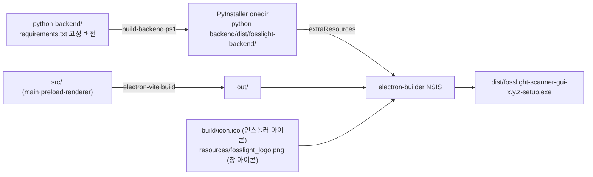

# 05. 빌드와 릴리스

## 개발 환경 준비

| 도구 | 버전 | 비고 |
|---|---|---|
| Node.js | 20+ | npm 포함 |
| Python | 3.12 | `py -3.12` 로 실행 가능해야 함 (백엔드 venv용) |
| git | 최신 | URL 스캔 기능 테스트에도 필요 |

```powershell
git clone -b newapp https://github.com/fosslight/fosslight_scanner_gui.git
cd fosslight_scanner_gui
npm install
npm run build:backend   # 최초 1회: venv 생성 + fosslight 설치 + PyInstaller (10분+)
npm run dev             # 개발 실행
```

- **개발 모드에서는 동결 exe를 쓰지 않습니다** — `scanRunner.ts`가 `app.isPackaged`가
  false면 `python-backend/.venv/Scripts/python.exe`로 래퍼를 직접 실행합니다.
  래퍼(py) 수정 → 바로 다음 스캔에 반영 (PyInstaller 재빌드 불필요).
- 백엔드 없이 UI만 만질 때는 `npm run build:backend` 없이도 `npm run dev`가 뜹니다
  (스캔 실행만 실패).

## npm 스크립트

| 스크립트 | 동작 | 언제 |
|---|---|---|
| `dev` | electron-vite dev (HMR) | 평상시 개발 |
| `typecheck` / `lint` | tsc + eslint | 커밋 전 |
| `build:backend` | `scripts/build-backend.ps1` → PyInstaller onedir | 백엔드/의존성 변경 시 |
| `build` | typecheck + electron-vite build | (dist가 내부 호출) |
| `dist` | build:backend + build + electron-builder --win | **정식 릴리스 빌드** |
| `dist:app-only` | build + electron-builder --win | JS/renderer만 변경 시 (빠름) |

산출물: `dist/fosslight-scanner-gui-<버전>-setup.exe` (약 259MB)

## 빌드 파이프라인



- 백엔드는 asar 밖의 `resources/backend/`로 들어갑니다 (electron-builder.yml의
  `extraResources`). 패키징된 앱은 `process.resourcesPath/backend/fosslight-backend.exe`를 spawn.
- 버전은 `package.json`의 `version` 하나만 올리면 인스톨러 파일명, 사이드바 표시,
  릴리스 태그가 모두 따라갑니다.

## 릴리스 절차 (newapp 브랜치 기준)

1. `package.json` 버전 올리기 (semver)
2. `npm run dist` (백엔드까지 변경됐으면) 또는 `dist:app-only` (JS만)
3. 스모크 테스트: `dist\win-unpacked\fosslight-scanner-gui.exe` 실행 →
   `test-fixtures/sample-project` 폴더 스캔 → 6개 페이지 확인 → 취소 동작 확인
4. 커밋 + push (`newapp`)
5. GitHub Release 생성 (태그 `v<버전>`, target: `newapp`) + `setup.exe`를 자산으로 업로드

> 현재는 수동 절차입니다. GitHub Actions로 자동화하려면 Windows runner에서
> `npm run dist` 후 `softprops/action-gh-release` 정도면 됩니다 (PyInstaller 빌드
> 캐시를 잡지 않으면 러너에서 15분+ 소요됨에 유의).

## 검증 체크리스트 (테스트 픽스처)

`test-fixtures/`에 목적별 샘플이 준비되어 있습니다:

| 픽스처 | 용도 |
|---|---|
| `sample-project/` | npm 프로젝트 (MIT/GPL/Apache 라이선스 헤더 + jar 바이너리) — 폴더 스캔 기본 검증 |
| `sample-src.zip` | 압축파일 스캔 검증 |
| `py-sample.zip` | Python sdist + 의존성 분석 (venv 생성 → Windows 정리 실패 경로 재현) |
| `flutter-sample/` | 자동 설치 미지원 도구 경고 경로 검증 |
| URL: `https://github.com/expressjs/vary` | URL(git clone) 스캔 검증 (MIT 4건 검출 기대) |

수동 E2E 최소 셋:

- [ ] 폴더 스캔 (all 모드) → source 5 / dependency 70 / binary 1 (sample-project 기준)
- [ ] 압축/URL 스캔 각 1회
- [ ] 스캔 중 취소 → 작업관리자에 `fosslight-backend`/python 잔존 없음, 재스캔 정상
- [ ] GPL 항목이 License Risk에서 '높음' 배지
- [ ] Vulnerability의 "NVD에서 검색" → 검색어가 유지된 NVD 결과 페이지
- [ ] 인스톨러 최종 검증은 **Python 미설치 클린 환경**(Windows Sandbox)에서

## 알려진 배포 제약

- **코드 서명 없음** → SmartScreen 경고 (INSTALL.md에 사용자 안내 있음)
- 인스톨러 크기 ~259MB (scancode 데이터) — MVP에서는 크기 최적화 안 함
- fosslight-scanner 버전은 `requirements.txt`에 고정 — 올릴 때는
  [RECON.md](../python-backend/RECON.md)의 함정들이 재현되는지 픽스처로 반드시 재검증
