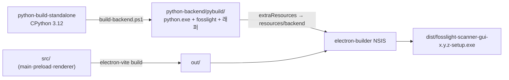

# 05. 빌드와 릴리스

## 개발 환경 준비

| 도구 | 버전 | 비고 |
|---|---|---|
| Node.js | 20+ | npm 포함. GitHub Actions 릴리스는 Node 22 |
| Python | 3.12 | 개발 venv와 설치본 번들 모두 3.12 |
| git | 최신 | URL 스캔 테스트에 필요 |

```powershell
git clone https://github.com/fosslight/fosslight_scanner_gui.git
cd fosslight_scanner_gui
npm install
py -3.12 -m venv python-backend\.venv
python-backend\.venv\Scripts\python.exe -m pip install -r python-backend\requirements.txt
npm run dev
```

- **개발 모드에서는 설치본 Python을 쓰지 않습니다.** `scanRunner.ts`는 `app.isPackaged`가
  false면 `python-backend/.venv/Scripts/python.exe`로 `src/backend_main.py`를 실행합니다.
  래퍼를 고치면 다음 스캔부터 반영되고, PyInstaller 재빌드는 없습니다.
- venv 없이 `npm run dev`를 띄울 수 있습니다. 스캔 실행만 실패합니다.
- `npm run build:backend`는 이 venv를 만들지 않습니다. 설치본용 `python-backend/pybuild/`를 만듭니다.

## npm 스크립트

| 스크립트 | 동작 | 언제 |
|---|---|---|
| `dev` | electron-vite dev (HMR) | 평상시 개발 |
| `typecheck` / `lint` | tsc + eslint | 커밋 전 |
| `build:backend` | `scripts/build-backend.ps1` | 백엔드/의존성 변경 시, 설치본을 만들기 전 |
| `build` | typecheck + electron-vite build | dist가 내부에서 호출 |
| `dist` | build:backend + build + electron-builder --win | 로컬에서 설치 파일 생성 |
| `dist:app-only` | build + electron-builder --win | JS만 바뀌었고 `pybuild/`가 이미 있을 때 |

`build-backend.ps1`은 python-build-standalone의 CPython 3.12를 받아
`python-backend/pybuild/python/python.exe`에 풀고, 아래를 설치한 뒤
`backend_main.py`와 `normalize_report.py`를 `pybuild/`로 복사합니다.

- `fosslight-scanner>=2.1.32`
- `fosslight-dependency>=4.1.56`
- `fosslight-util>=2.2.16`

설치 전략은 `--upgrade-strategy eager`입니다. PyInstaller는 호출하지 않습니다.

산출물 파일명: `dist/fosslight-scanner-gui-<버전>-setup.exe`

## 빌드 파이프라인


```mermaid
flowchart LR
    A["python-build-standalone<br/>CPython 3.12"] -->|build-backend.ps1| B["python-backend/pybuild/<br/>python.exe + fosslight + 래퍼"]
    C["src/ (main·preload·renderer)"] -->|electron-vite build| D["out/"]
    B -->|extraResources → resources/backend| E["electron-builder NSIS"]
    D --> E
    E --> G["dist/fosslight-scanner-gui-x.y.z-setup.exe"]
```

- 패키징된 앱은 `process.resourcesPath/backend/python/python.exe`로
  `resources/backend/backend_main.py`를 실행한다.
- `postinstall`은 NSIS 템플릿을 고친다. 설치 진행 문구를 켜고, TEMP에 풀었다가
  다시 복사하지 않고 설치 폴더에 직접 해제한다 (`scripts/patch-nsis-template.js`).
- 인스톨러는 oneClick이 아니다. 설치 경로를 바꿀 수 있고, 바탕화면 바로가기를 만든다.
  기본은 사용자 단위 설치다.
- 사이드바에 보이는 버전은 `package.json`의 `version`이다. 태그로 릴리스하면
  Actions가 태그 이름으로 그 버전을 덮어쓴다.

## 릴리스 절차

태그를 푸시하면 `.github/workflows/release.yml`이 설치 파일을 만들어 GitHub Release에 올린다.

1. `main`에 릴리스할 커밋을 올린다.
2. `v<버전>` 태그를 푸시한다. 예: `v1.0.1`
3. Actions가 태그에서 `v`를 뺀 값으로 `package.json` 버전을 맞추고,
   `npm run build:backend` 다음 `electron-builder --win --publish never`를 실행한다.
4. `dist/*.exe`, `dist/*.blockmap`, `dist/latest.yml`이 그 태그의 Release 자산이 된다.

로컬에서 설치 파일만 만들 때는 `npm run dist`를 쓴다. 이때 버전은 `package.json`을 따른다.

앱은 시작 시 GitHub Release의 `latest.yml`을 본다. 새 버전이 있으면 사용자가 다운로드를
고른 뒤에만 받고, 재시작 때 설치 마법사를 연다. 확인에 실패하면 안내 없이 현재 버전으로 계속한다.

## 상류(fosslight-*) 업데이트 시 회귀 검사

`build:backend`는 하한 이상의 최신 상류를 설치한다. 결과가 달라졌는지 릴리스 전에 확인한다.

```bash
python-backend\pybuild\python\python.exe scripts\run-regression.py
```

- 픽스처 기본 경로는 `D:\fosslight_dependency_scanner\tests` (`--tests-dir` 또는 `FL_TESTS_DIR`)
- 기준선은 `scripts/regression-baseline.json`
- 기준선과 다르면 종료 코드 1. 의도된 변화면 `--update`
- `--only pypi,gradle2`, `--clean-gradle` (Gradle 캐시를 비우고 빌드 스크립트 재컴파일까지 확인)

Java는 `FL_TEST_JRE11` / `FL_TEST_JDK17`이 없으면 해당 픽스처를 SKIP한다.
go·helm이 없으면 SKIP이다. maven은 `FL_TEST_MVN` 또는 `%LOCALAPPDATA%\fl-verify\mvn`을 찾는다.

Git Bash에서 돌릴 때를 대비해 스크립트가 `NoDefaultCurrentDirectoryInExePath`를 지운다.
이 값이 있으면 `mvnw.cmd`를 이름만으로 실행하지 못해 maven 분석이 0건이 된다.

## 알려진 배포 제약

- 코드 서명이 없어 설치 시 SmartScreen 경고가 난다.
- 라이선스 인덱스 캐시는 설치 파일에 없고, 첫 Source 분석 때
  `%LOCALAPPDATA%\FOSSLightScanner\scancode`에 만든다.
- 상류 버전을 올릴 때는 [RECON.md](../python-backend/RECON.md)의 함정과 회귀 검사를 함께 본다.
