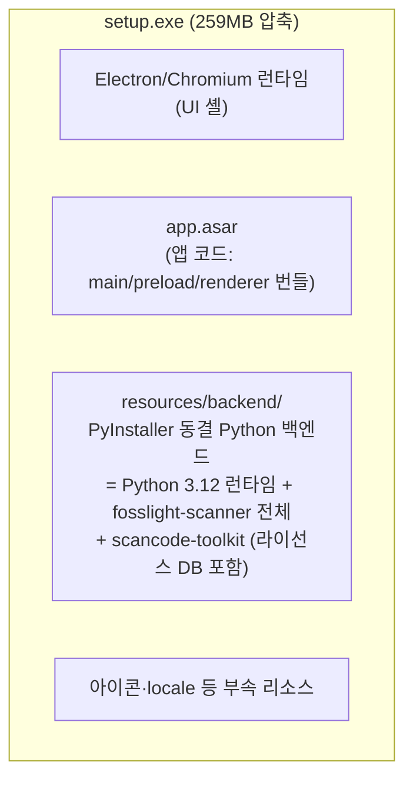
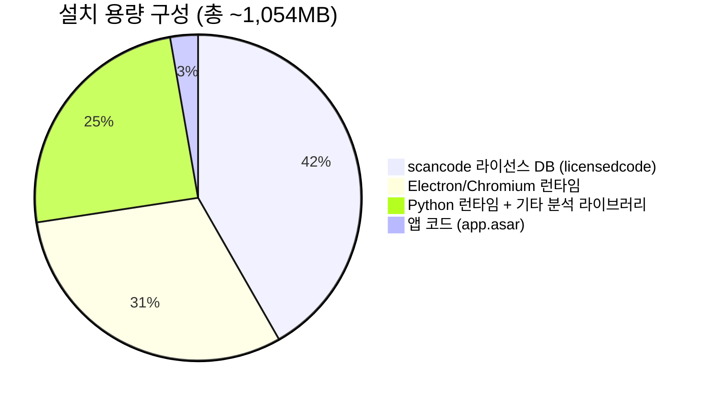

# 06. 배포물 구성과 설치 용량

인스톨러에 무엇이 들어가고, 설치하면 무엇이 생기며, 왜 약 1GB를 차지하는지 정리합니다.
수치는 v0.2.2 기준 실측값입니다 (버전에 따라 소폭 변동).

## 1. 설치 파일(인스톨러)에 포함되는 것

`fosslight-scanner-gui-<버전>-setup.exe` (약 259MB, NSIS/LZMA 압축) 하나에
아래가 전부 들어 있습니다. **최종 사용자는 다른 것을 설치할 필요가 없습니다.**

| 구성 요소 | 내용 | 원본(비압축) 크기 |
|---|---|---|
| Electron/Chromium 런타임 | `fosslight-scanner-gui.exe`(201MB), locales(44MB), GPU/ICU DLL 등 | 약 325MB |
| `resources/app.asar` | 우리가 작성한 앱 코드 + 렌더러 번들(React, recharts 등 포함) | 28.6MB |
| `resources/backend/` | 동결 Python 백엔드 (아래 3절 상세) | 699MB |
| 기타 | elevate.exe, 아이콘 등 | <1MB |

포함되지 **않는** 것: 분석 대상 프로젝트의 패키지 매니저(npm, Maven 등) —
이는 대상 프로젝트마다 달라 번들이 불가능하며, 필요 시 런타임에 자동 설치합니다(2절).

## 2. 설치 실행 시 시스템에 생기는 것

### 설치 시점 (setup.exe 실행)

| 항목 | 위치/내용 |
|---|---|
| 프로그램 본체 | 기본 `%LOCALAPPDATA%\Programs\fosslight-scanner-gui\` (설치 화면에서 변경 가능, 사용자 단위 설치) |
| 바로가기 | 바탕화면 + 시작 메뉴 |
| 제거 정보 | Windows "설정 > 앱" 목록 등록 + 설치 폴더의 Uninstall exe |

**하지 않는 것**: 서비스 등록, PATH/환경변수 변경, 시스템 전역 레지스트리 변경,
타 프로그램 설치. 관리자 권한도 기본적으로 불필요합니다(사용자 단위 설치).

### 첫 실행 이후 생성되는 데이터

| 항목 | 위치 | 내용 |
|---|---|---|
| 앱 데이터 | `%APPDATA%\fosslight-scanner-gui\` | `recent-scans.json`(최근 스캔 10건), `logs\scan.log`(백엔드 stderr), Chromium 캐시 |
| 스캔 리포트 | 사용자가 지정한 출력 폴더 | `fosslight_report_*.xlsx/.yaml`, `gui_result.json` |

### 런타임 조건부 설치 (의존성 분석 도구 자동 설치)

폴더를 의존성 분석할 때 필요한 패키지 매니저가 없으면 **winget으로 자동 설치**합니다
(진행 상황이 "도구 설치" 단계로 표시됨). 이는 앱 설치가 아니라 사용 시점의 선택적
설치이며, 대상은 manifest에 따라 다릅니다:

| 감지 파일 | 설치 대상 (winget) |
|---|---|
| package.json | Node.js LTS |
| pom.xml / build.gradle | Maven / Gradle (+ Temurin JDK 21) |
| requirements.txt, setup.py, Pipfile | Python 3.12 |
| go.mod / Cargo.toml / Gemfile | Go / Rustup / Ruby |
| pubspec.yaml | (자동 설치 미지원 — 수동 안내) |

## 3. 설치 용량 약 1GB — 주요 점유 항목

설치(비압축) 총 **약 1,054MB**. 내역:

| 순위 | 항목 | 크기 | 설명 |
|---|---|---|---|
| 1 | `backend\_internal\licensedcode` | **440MB** | scancode-toolkit의 라이선스 탐지 데이터. 그중 `data/cache` 394MB(사전 빌드된 라이선스 인덱스), `rules` 27MB(탐지 규칙 3만+개), `licenses` 18MB(라이선스 원문). **Source 분석의 정확도가 여기서 나옵니다** |
| 2 | Electron/Chromium 런타임 | **325MB** | exe 201MB + locales 44MB + GPU/ICU/기타 DLL. Electron 앱의 고정 비용 |
| 3 | 백엔드의 나머지 Python 스택 | **260MB** | numpy(40MB), libarchive/libmagic 네이티브(30MB), matplotlib+PIL(27MB — fosslight_util의 그래프 의존성), pandas(13MB), grpc(11MB), Python 3.12 런타임 등 수백 개 패키지 |
| 4 | `app.asar` | 29MB | 우리가 작성한 코드 + 렌더러 번들 |

### 왜 이 용량을 그대로 두는가 (설계 결정)

- **licensedcode 440MB**: 제거하면 source 분석이 불가능. 인덱스 캐시(394MB)를 빼고
  첫 실행 시 생성하게 할 수도 있으나, 첫 스캔이 수 분 느려지고 실패 지점이 늘어남.
- **onedir(비압축 배치)**: onefile로 만들면 설치 크기는 줄지만 **매 실행마다**
  수백 MB를 %TEMP%에 풀어야 해서 스캔 시작이 수십 초 느려지고 백신 오탐이 잦음.
- 인스톨러 자체는 LZMA 압축으로 1,054MB → 259MB로 배포됩니다.

### 용량을 줄이고 싶다면 (후속 과제 후보)

1. matplotlib/PIL — fosslight_util이 리포트 그래프용으로 끌어오는 의존성 (~27MB).
   PyInstaller `excludes`로 제외 가능한지 검증 필요 (그래프 기능 미사용 확인 후)
2. `licensedcode/data/cache` 최초 실행 시 생성 방식 검토 (위 트레이드오프 참고)
3. Electron 대신 Tauri(WebView2) 전환 시 런타임 ~300MB 절감 — 대규모 공사
