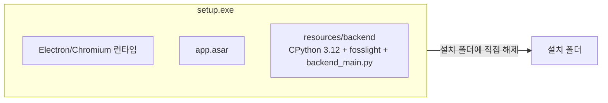

# 06. 배포물 구성과 실행 시 생기는 파일

## 1. 설치 파일에 포함되는 것

`fosslight-scanner-gui-<버전>-setup.exe` 하나에 앱을 실행하는 데 필요한 파일이 들어 있다.
설치 중에는 분석 엔진을 따로 받지 않는다. 오프라인 PC에서도 설치할 수 있다.

```mermaid
flowchart LR
    subgraph SETUP["setup.exe"]
        A["Electron/Chromium 런타임"]
        B["app.asar"]
        C["resources/backend<br/>CPython 3.12 + fosslight + backend_main.py"]
    end
    SETUP -->|"설치 폴더에 직접 해제"| INST["설치 폴더"]
```

| 구성 요소 | 내용 |
|---|---|
| Electron/Chromium | `fosslight-scanner-gui.exe`, locales, DLL |
| `resources/app.asar` | 메인·프리로드·렌더러 번들 |
| `resources/backend/` | `python-backend/pybuild` 전체. `python/python.exe`, site-packages의 fosslight, `backend_main.py`, `normalize_report.py` |

포함되지 않는 것:

- 분석 대상 프로젝트의 패키지 매니저(npm, Go, Helm 등). 스캔 시점에 필요하면 설치한다.
- scancode 라이선스 **인덱스 캐시**. 첫 분석 때 사용자 프로필 아래에 만든다. 라이선스 규칙 데이터 자체는 scancode 패키지 안에 있다.
- `gui_result.json`. 스캔이 성공한 뒤에 생긴다.

NSIS는 TEMP에 풀었다가 복사하지 않고 설치 폴더에 직접 해제한다. `scripts/patch-nsis-template.js`가 electron-builder 템플릿을 그렇게 고친다.

예전에 PyInstaller로 묶던 설치본의 용량(설치 파일 약 259MB, 설치 후 약 1GB, 그중 licensedcode 캐시 440MB)은 현재 번들의 크기가 아니다. 그 캐시는 설치 폴더 밖에 두고, 백엔드는 실행 파일이 아니라 Python 트리이다.

## 2. 설치 후 시스템에 생기는 것

### 설치 시점

| 항목 | 내용 |
|---|---|
| 프로그램 | 기본 `%LOCALAPPDATA%\Programs\fosslight-scanner-gui\`. 설치 화면에서 바꿀 수 있다 |
| 바로가기 | 바탕화면과 시작 메뉴 |
| 제거 | Windows 설정 > 앱에 등록되고, 설치 폴더에 제거 프로그램이 생긴다 |

서비스 등록, 시스템 PATH 변경, 다른 프로그램 설치는 하지 않는다. 관리자 권한 없이 사용자 단위로 설치할 수 있다. 경로를 Program Files로 바꾸면 그때는 권한이 필요할 수 있다.

### 실행 이후

| 항목 | 위치 | 내용 |
|---|---|---|
| 최근 결과 | `%APPDATA%\fosslight-scanner-gui\gui_result.json` | 마지막 성공 스캔의 정규화 결과. 앱이 다시 열 때 이 파일을 읽는다 |
| 최근 목록 | 같은 폴더의 `recent-scans.json` | 최대 10건. 파일이 지워진 항목은 목록에서 빠진다 |
| 스캔 리포트 | 사용자가 지정한 출력 폴더 | `fosslight_report_*.xlsx`, `fosslight_gui_<시각>.log` |
| 라이선스 인덱스 | `%LOCALAPPDATA%\FOSSLightScanner\scancode` | 첫 Source 분석 때 생성. 이후 스캔은 재사용 |
| Java | `%APPDATA%\fosslight-scanner-gui\dep-java` 또는 `dep-jdk` | 시스템에 Java가 없을 때 Temurin 11 JRE, 버전 카탈로그면 Temurin 17 JDK |
| Maven | 같은 폴더의 `dep-maven` | `mvnw`와 `mvn`이 없을 때 Apache Maven 3.9.9 |

로그 파일은 스캔 화면 콘솔과 같은 `[레벨] 메시지` 형식이다. 종료 코드가 0이 아니면, 화면에 없던 stderr를 최대 64KB까지 파일 끝에 붙인다. 구현은 `src/main/scanRunner.ts`이다.

`gui_result.json`은 출력 폴더에 쓰지 않는다. `--result-file`이 userData 경로를 넘긴다.

### 스캔 중에만 설치되는 도구

Dependency 분석에 필요하고 PC에 없을 때만 준비한다. 앱 설치와는 별개다.

| 감지 파일 | 준비 방법 |
|---|---|
| package.json | winget으로 Node.js LTS. 실패하면 공식 zip을 받아 그 스캔의 PATH에만 넣는다 |
| pom.xml | `mvnw`나 `mvn`이 없으면 Apache Maven 3.9.9를 받는다. Java도 없으면 아래 Java를 받는다 |
| build.gradle, build.gradle.kts | Gradle은 받지 않는다. Java가 없으면 Temurin 11 JRE. 버전 카탈로그가 있으면 Temurin 17 JDK |
| requirements.txt, setup.py, setup.cfg, pyproject.toml, Pipfile | 번들 Python으로 venv를 만든다 |
| go.mod, Chart.yaml, Cargo.toml, Gemfile | winget으로 Go, Helm, Rustup, Ruby |
| pubspec.yaml | 설치하지 않고 Flutter를 직접 설치하라고 안내한다 |
| Podfile, Podfile.lock | Windows에서는 분석하지 않는다고 안내한다 |

winget 설치 중 Windows 권한 창이 나오면 사용자가 허용해야 계속된다. 설치에 실패해도 스캔 전체를 멈추지는 않고, 그 도구가 필요한 분석만 실패할 수 있다.
